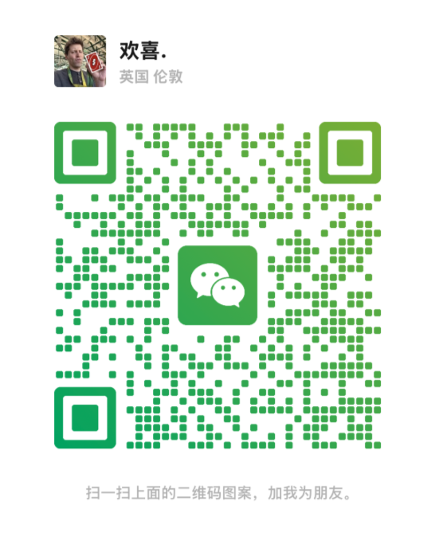

# 多 AI 对话保存器

很多时候，我们需要在不同 AI 之间来回切换：ChatGPT、Gemini、Claude、Manus，甚至不同的 coding 工具。问题是，一旦切换平台，原来的上下文很容易崩塌，你不得不重新解释项目背景、需求和历史对话。

多 AI 对话保存器就是为这个痛点做的。它可以把对话直接导出成结构化 JSON，而不是只导出成 Markdown 文档。这样你在新的 AI 聊天或 coding 软件里，不需要重新介绍项目，只要把 JSON 文件上传进去，就能更低成本地续上上下文。

## 这个产品可以干什么

- 创建容器，把不同主题的 AI 对话分开保存
- 给容器打标签，方便后续整理
- 导入 ChatGPT、Gemini、Claude、Manus 等分享链接
- 支持粘贴文本或抓取当前页面内容
- 自动识别 `user` 和 `assistant` 消息，并整理成统一结构
- 在容器里查看对话列表和运行日志
- 一键下载当前容器的 JSON 数据

## 支持的平台

- ChatGPT
- Gemini
- Claude
- Manus
- 纯文本粘贴解析

## 如何本地运行

```bash
npm install
npm run build
```

## 告诉用户怎么上传

### 方法 1：开发模式上传

1. 在项目目录执行 `npm run build`
2. 打开 Chrome，进入 `chrome://extensions`
3. 打开右上角的“开发者模式”
4. 点击“加载已解压的扩展程序”
5. 选择项目里的 `dist` 目录

### 方法 2：用打包好的 zip

1. 先执行 `npm run build`
2. 把 `dist` 目录压缩成 zip
3. 如果是自己本地安装，仍然建议先解压后再通过“加载已解压的扩展程序”导入

## 导出的 JSON 里有什么

- 容器信息
- 标签信息
- 对话列表
- 每条对话的来源链接
- 整理后的 `turns` 结构
- 消息数量等摘要统计

## 目录说明

- `src/components/ContainerBoard.tsx`
  容器列表页
- `src/components/ContainerDetail.tsx`
  容器详情页，对话列表和运行日志都在这里
- `src/components/PasteParser.tsx`
  统一导入入口
- `src/background/background.ts`
  后台抓取和链接解析逻辑
- `src/lib/conversation.ts`
  对话清洗、角色纠偏、标题整理

## 开发者微信

微信名：欢喜


